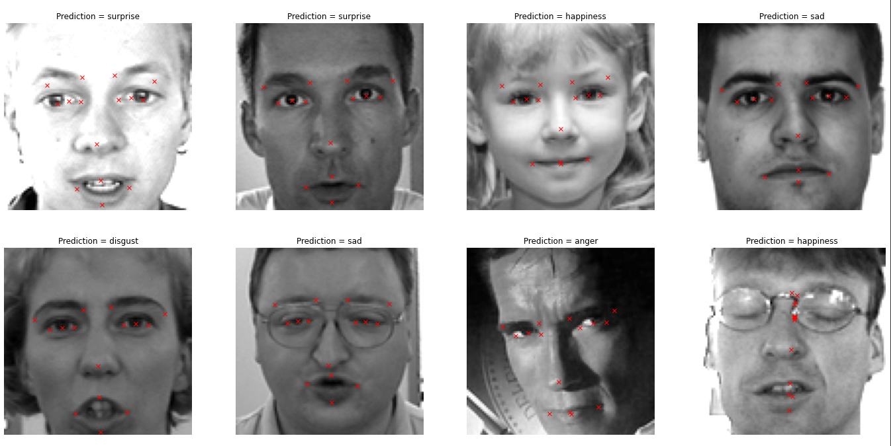
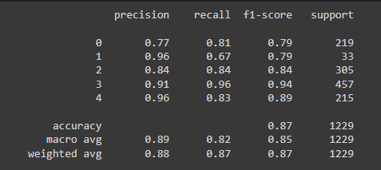

<h1 align="center"> Facial Expression and Emotion Classifier </h1>
<h3 align="center"> The purpose of this project is to classify people's emotions based on their facial images. The system automatically monitors people's facial expressions. </h3>  

 

 
  

<h3 align="center"> Project Status: [Completed]</h3> 

## Project Description
The system automatically monitors people's facial expressions. 20,000+ images with their associated facial expression labels and 2000+ images with facial keypoints annotations. two deep Neural Networks (DNN) were developed and deployed. The first model leverages Convolutional Neural Networks and Residual blocks to predict facial keypoints, The second DNN model classifies people's emotions such as anger, disgust, happiness, sadness and suprise.

### Methods Used
* Inferential Statistics
* Machine Learning
* Data Visualization
* Predictive Modeling
* Deep Neural Networks

### Technologies
* Python
* Pandas, Colab
* TensorFlow 2.11.1
* Keras API
* ResNet50
* Matplotlib
* etc. 

## Learning Outcomes

- Understand how to leverage the power of Artificial Intelligence AI to detect people's emotions
- Understand the theory and intuition behind residual networks
- Develop Artificial Neural Network (ANNs) models and train them in Google Colab while leveraging the power of GPUs and TPUs
- Build, train, test and deploy ResNets to perform Image classification using real world datasets
- Perform Image Augmentation to improve the generalization capability of the model
- Evaluate trained ResNet on testing data using various KPIs
- Know the difference between various activation functions such as Sigmoid and Rectified Linear Units (RELU)
- Appy Keras API and TensorFlow 2.0 to build DNNs
- Understand the difference between precison and recall
- Perform Joint models predictions from both key facial points model and facial expressions classification model
- Deploy both Deep Neural Networks using TensorFlow 2.0 Serving to make predictions 

## Getting Started
1. Clone this repo (for help see this [tutorial](https://help.github.com/articles/cloning-a-repository/)).
2. Raw Data is being kept [here](https://drive.google.com/drive/folders/1eO3R7uXo93bZ4HYO6RTT5a7-hjotpC5W?usp=sharing) within this repo.
