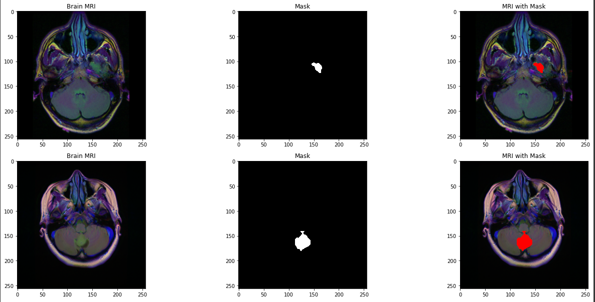
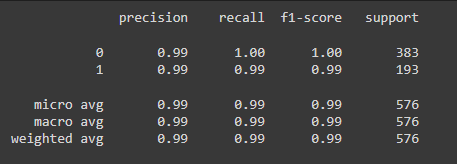

<h1 align="center"> Brain Tumor Detector </h1>
<h3 align="center">  Improve speed and accuracy of detecting brain tumors based on MRI scans in order to reduce the cost of cancer diagnosis. </h3>  

 

 
  

<h3 align="center"> Project Status: [Completed]</h3> 

## Project Description
Practical use of AI in the medical sector in form of disease diagnosis with medical imaging. Improve speed and accuracy of detecting brain tumors based on MRI scans in order to reduce the cost of cancer diagnosis and help in early diagnosis of tumors. the dataset consists of 3900 brain MRI scans along with their brain tumor locations. Two models were developed, the first model detects if a tumor exists in the brain MRI scan, if a tumor exists, the image is fed to a segmentation ResUnet model which localises and segments the tumor.

### Methods Used
* Inferential Statistics
* Machine Learning
* Data Visualization
* Predictive Modeling
* Deep Neural Networks

### Technologies
* Python
* Pandas, Colab
* TensorFlow 2.11.1
* Keras API
* ResNet50
* Matplotlib, plotly
* etc. 

## Learning Outcomes

- Learn how to leverage the power of AI to improve disease detection and localization processes
- Build and train a segmentation ResUnet model to localize brain tumors in images
- Understand the Intuition and power of transfer learning
- List the various advantages of transfer learning and know when to properly apply the technique to speed up training processes
- Evaluate trained ResNet classifier network and ResUnet segmentation network on test data
- Apply Keras API to build DNNs
- use plotly to generate interactive plots and data visualizations

## Getting Started
1. Clone this repo (for help see this [tutorial](https://help.github.com/articles/cloning-a-repository/)).
2. Raw Data is being kept [here](https://drive.google.com/drive/folders/1pIPXbdi4Tf440OhlYZ8f97Jc-tbCoGt8?usp=sharing) within this repo.
